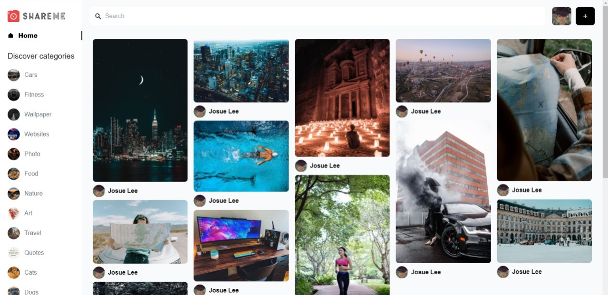
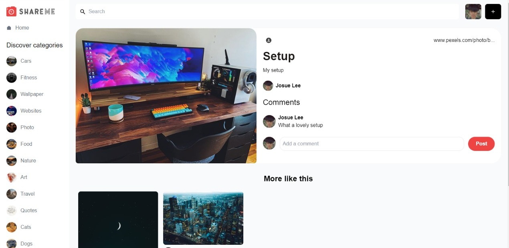
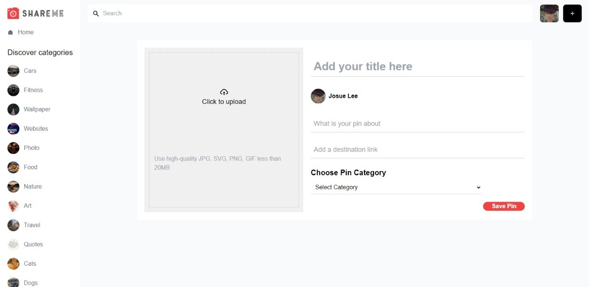
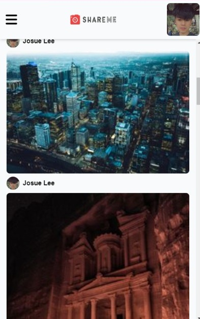
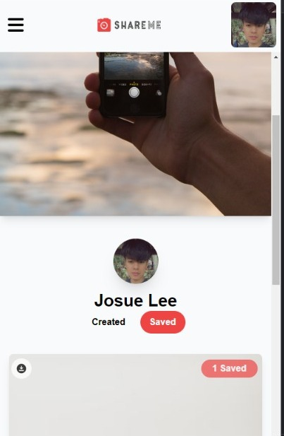
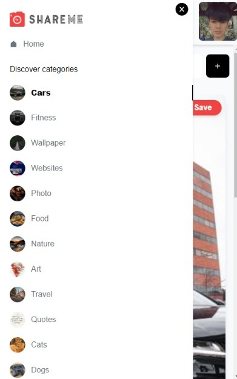
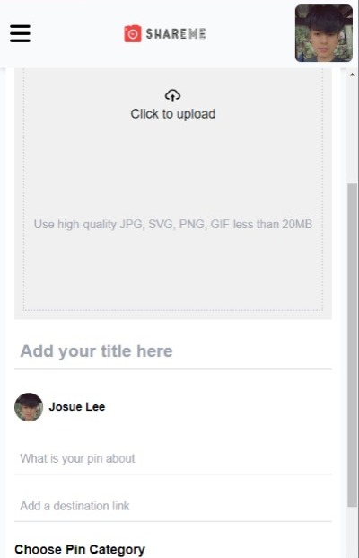

# SHAREME APP

To use this social media app you have to log in with google, you can create a new post, comment on a post, save a post that you liked, and also it has the feature of searching for any post. This is a full-stack application using react js, react-router-dom@6, react-OAuth-google, tailwind CSS for the frontend, and sanity studio for the backend.

npm install to add node modules and libraries - npm start to run this proyect

- React JS
- Hooks
- React router dom
- Tailwin CSS
- Sanity Studio
- react-oauth/google

## Desktop Version

## Mobile Version

